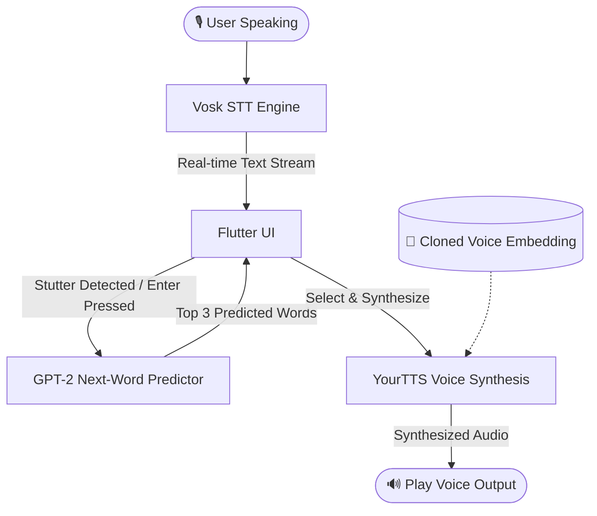
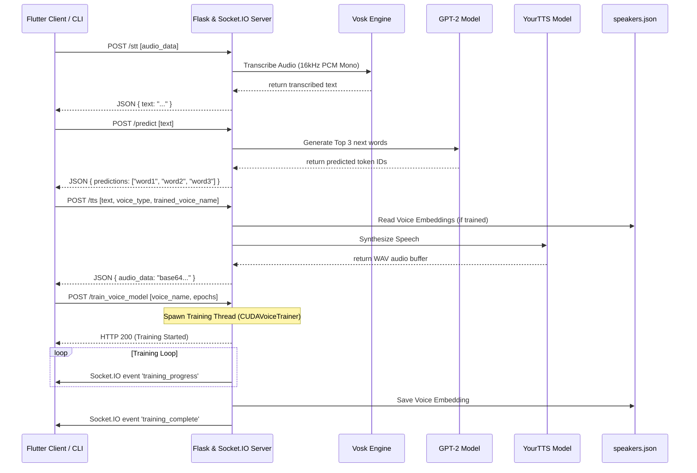

# SoundWave: Speech Assistance For People With Stuttering

<div align="center">

[](https://www.python.org/)
[](https://flutter.dev/)
[](https://pytorch.org/)
[](https://flask.palletsprojects.com/)
[](https://socket.io/)
[](https://huggingface.co/gpt2)

**An AI-powered assistive communication platform that helps individuals with speech disfluencies and stuttering communicate fluidly in real-time.**

</div>

---

## 📖 Table of Contents
1. [Overview](#-overview)
2. [Key Features](#-key-features)
3. [System Architecture](#-system-architecture)
4. [Prerequisites & System Requirements](#-prerequisites--system-requirements)
5. [Getting Started](#-getting-started)
   - [Automated Environment Setup](#1-automated-environment-setup)
   - [Manual Model Installation](#2-manual-model-installation)
   - [Running the Backend Server](#3-running-the-backend-server)
   - [Running the Flutter Frontend](#4-running-the-flutter-frontend)
   - [Running the CLI Applications](#5-running-the-cli-applications)
6. [API Documentation](#-api-documentation)
   - [REST HTTP Endpoints](#rest-http-endpoints)
   - [Socket.IO WebSocket Events](#socketio-websocket-events)
7. [Troubleshooting Guide](#-troubleshooting-guide)
8. [License](#-license)

---

## 🔍 Overview

Stuttering disrupts speech fluency, causing repetitions, prolonged sounds, and hesitations that can make verbal communication stressful. **SoundWave** bridges this gap using a real-time, personalized AI speech pipeline:

1. **Automatic Speech Recognition (ASR)**: Translates the user's spoken voice to text in real-time using an offline Vosk model.
2. **Next-Word Prediction**: Employs GPT-2 to anticipate the user's intended word from their context, offering options to bridge hesitations.
3. **Voice Cloning & TTS**: Synthesizes the completed sentence using **YourTTS** and **SpeechBrain** embeddings, projecting the generated text back in the user's own cloned voice rather than a generic machine synthesizer.

---

## ✨ Key Features

*   **Offline Speech-to-Text**: Low-latency, privacy-preserving local transcription using the Vosk engine.
*   **Predictive Assistance**: Contextual next-word suggestion powered by GPT-2.
*   **Dynamic Voice Cloning**:
    *   *Zero-Shot Cloning*: Record a 30-second reference audio to instantly clone and synthesize speech.
    *   *Profile Training*: Create a permanent voice model by feeding custom voice datasets into our trainer module.
*   **Cross-Platform Client**: Fluid, responsive interface built with Flutter (supporting Desktop/Mobile).
*   **Background Voice Training**: Async model training on CUDA GPUs or CPUs with real-time websocket progress reporting.
*   **Standalone CLI Utilities**: Lightweight CLI tool for real-time speech prediction and a Tkinter-based dataset recorder.

---

## 📐 System Architecture

### 1. High-Level Data Flow



### 2. Client-Server Architecture



---

## 💻 Prerequisites & System Requirements

*   **Operating System**: Windows (Tested on Windows 10/11), Linux, or macOS.
*   **Python**: Version `3.10.11` (Strictly required for compatibility with PyTorch/Coqui TTS dependencies).
*   **Hardware (Recommended)**: NVIDIA GPU with **CUDA 11.8+** (for real-time speech synthesis and fast voice profile training).
*   **Flutter SDK**: Flutter 3.0+ (required for compilation of the Flutter app client).

---

## 🚀 Getting Started

### 1. Automated Environment Setup

SoundWave comes with an automated Python setup utility `setup_env.py` that handles virtual environment initialization, checks for correct Python version, upgrades package managers, and installs all dependencies in a virtual environment (`.venv`).

Execute the setup script from the root directory:

```powershell
# Run env setup (will automatically download Python 3.10.11 if missing on Windows)
python setup_env.py
```

To activate the created virtual environment:
*   **Windows**:
    ```powershell
    .venv\Scripts\activate
    ```
*   **Linux/macOS**:
    ```bash
    source .venv/bin/activate
    ```

### 2. Manual Model Installation

SoundWave relies on local offline models. Download and place them in the correct directories before running the server:

1.  **Vosk Model**:
    *   Download the English speech model: [vosk-model-small-en-us-0.15.zip](https://alphacephei.com/vosk/models/vosk-model-small-en-us-0.15.zip).
    *   Extract the contents into the project root directory.
    *   Ensure the directory name is precisely: `vosk-model-small-en-us-0.15`.
2.  **GPT-2 & YourTTS Models**:
    *   These will automatically download to their respective cache directories (`~/.cache/huggingface` and `~/.local/share/tts`) during the first application run.

### 3. Running the Backend Server

Start the Flask-SocketIO backend web server:

```bash
# Make sure your virtual environment is active
python server.py
```
By default, the server runs on `http://127.0.0.1:5000` (or falls back to other ports if occupied).

### 4. Running the Flutter Frontend

To compile and launch the UI desktop/mobile client:

```bash
cd soundwave
# Get Flutter packages
flutter pub get
# Run the application
flutter run
```

### 5. Running the CLI Applications

If you prefer to interact via terminal utilities:

*   **Realtime CLI Predictor**:
    An interactive CLI tool that monitors your microphone, transcribes speech, predicts next words using GPT-2, and plays synthesized voice output.
    ```bash
    python rtvctrained.py
    ```

*   **Voice Dataset GUI Recorder**:
    A Tkinter-based helper application to quickly record short sentences for your voice cloning dataset.
    ```bash
    python datasetcreator.py
    ```

---

## 🔌 API Documentation

### REST HTTP Endpoints

| Endpoint | Method | Description | Request Payload | Response Payload |
| :--- | :--- | :--- | :--- | :--- |
| `/ping` | `GET` | Health check probe | None | `{"status": "ok"}` |
| `/stt` | `POST` | Transcribes audio bytes | `{"audio_data": "base64_wav"}` | `{"text": "hello world"}` |
| `/predict` | `POST` | Predicts next 3 likely words | `{"text": "I would like to"}` | `{"predictions": ["go", "have", "be"]}` |
| `/tts` | `POST` | Generates speech audio | `{"text": "...", "voice_type": "cloned/trained", "trained_voice_name": "...", "reference_audio": "base64_wav"}` | `{"audio_data": "base64_wav"}` |
| `/record_reference` | `POST` | Caches dynamic voice sample | `{"audio_data": "base64_wav"}` | `{"message": "...", "reference_audio_base64": "..."}` |
| `/list_voices` | `GET` | Lists trained voice profiles | None | `{"voices": ["alex", "emma"]}` |
| `/set_voice` | `POST` | Sets default voice profile | `{"voice_name": "alex"}` | `{"message": "Default voice set..."}` |
| `/list_dataset_samples` | `GET` | Lists WAV dataset samples | None | `{"samples": ["audio1.wav", "audio2.wav"]}` |
| `/add_dataset_sample` | `POST` | Adds sample to dataset pool | `{"sample_name": "...", "audio_data": "base64..."}` | `{"message": "...", "sample_name": "..."}` |
| `/delete_dataset_sample`| `POST` | Deletes sample from dataset pool | `{"sample_name": "audio1.wav"}` | `{"message": "Sample deleted..."}` |
| `/train_voice_model` | `POST` | Initiates training profile | `{"voice_name": "alex", "epochs": 50, "force_cpu": false}` | `{"status": "Training voice model..."}` |

### Socket.IO WebSocket Events

The application uses WebSocket notifications to track heavy AI training routines:

*   **`training_progress`**: Dispatched during voice profile embedding extraction and training simulation.
    *   Payload: `{"progress": 45, "status": "Training voice model 'alex': 45% complete (loss: 0.6550)", "voice_name": "alex"}`
*   **`training_complete`**: Dispatched on successful generation of the profile.
    *   Payload: `{"success": true, "voice_name": "alex", "status": "Voice model 'alex' trained successfully!"}`
*   **`training_error`**: Dispatched if the training process fails.
    *   Payload: `{"error": "Training failed: ...", "voice_name": "alex"}`

---

## 🛠️ Troubleshooting Guide

### 1. Vosk Model Missing Errors
*   **Symptom**: `Failed to load Vosk model: [Errno 2] No such file or directory` on server launch.
*   **Solution**: Ensure that you have downloaded the Vosk model and extracted it into the root directory under the folder name `vosk-model-small-en-us-0.15`. The server expects to find this directory at `BASE_DIR / "vosk-model-small-en-us-0.15"`.

### 2. PyTorch CUDA Unavailable / Slow TTS
*   **Symptom**: Synthesis takes 5+ seconds and logs display `TTS model loaded successfully (GPU: False)`.
*   **Solution**: Reinstall PyTorch with explicit CUDA support. Run:
    ```bash
    pip install torch torchaudio --index-url https://download.pytorch.org/whl/cu118 --force-reinstall
    ```
    Verify CUDA status: `python -c "import torch; print(torch.cuda.is_available())"` (should output `True`).

### 3. Missing `libsndfile` on Linux
*   **Symptom**: `OSError: sndfile library not found` on server startup.
*   **Solution**: Install system audio packages:
    *   *Ubuntu/Debian*: `sudo apt-get install libsndfile1`
    *   *macOS (Brew)*: `brew install libsndfile`

### 4. Flutter API Connection Issues
*   **Symptom**: Flutter client fails to reach backend server, showing connection timeout.
*   **Solution**: Check your server address config in [api_service.dart](file:///e:/project/SoundWave-main/soundwave/lib/services/api_service.dart). If running on an emulator or a real mobile device, change `localhost` / `127.0.0.1` to the server host machine's local IP address (e.g., `192.168.1.X`).

---

## 📄 License

This project is licensed under the MIT License. See the LICENSE file for details.
